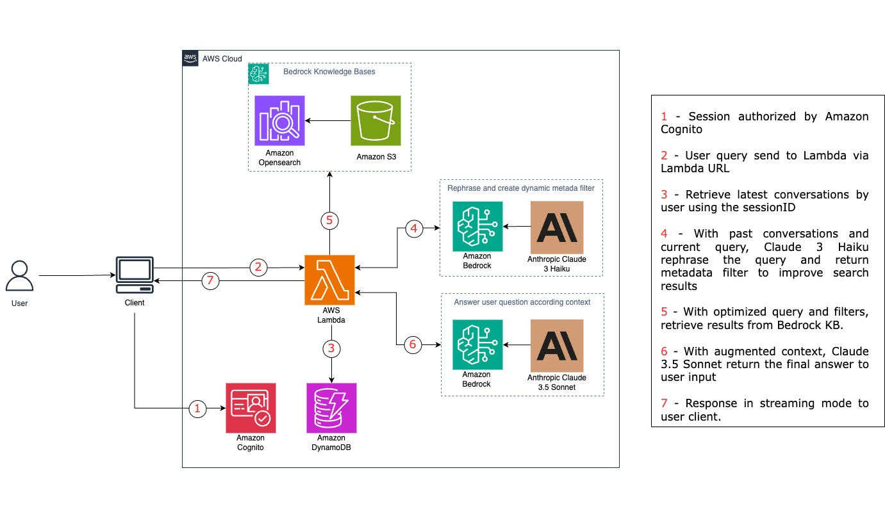

# Financial Assistant powered by 

## Overview

The system utilizes Generative AI to expedite the analysis and interpretation of complex financial data and documentation. It features a chat-style interface where users can pose open-ended questions related to any financial information contained within the source materials, and receive accurate, data-driven responses within seconds.

With the new Generative AI system in place, the AI model can ingest and process a vast array of financial documents, including research reports, competitor earnings releases, central bank publications, and internal strategy documents. By leveraging this comprehensive knowledge base, the system can generate insightful analyses and explanations that would have been difficult or impossible to uncover through manual efforts alone.

> [!NOTE] 
> This a scenario for this project only. You can personalize the prompts and the data to bring answers related to any data and scope you like. We recommend you choosing the data you want and create your metadata accordingly to improve search results.

## Architecture



## Folder Structure

This sample application codebase is organized into these key folders:

```
financial-assistant-prototype
│
├── data                                            # Public data
├── src                                             # source directory
├── ingest_files.py                                 # Ingestion script
```

## Getting started
> [!IMPORTANT] 
>
>**Deploying the solution**
>
>Follow with attention the general guidelines on [README](src/README.md) to deploy and customize the solution accordingly your needs.

> [!WARNING]
>
>This sample allows you to interact with models from third party providers. Your use of the third-party generative AI (GAI) models is governed by the terms provided to you by the third-party GAI model providers when you acquired your license to use them (for example, their terms of service, license agreement, acceptable use policy, and privacy policy).
>
>You are responsible for ensuring that your use of the third-party GAI models comply with the terms governing them, and any laws, rules, regulations, policies, or standards that apply to you.
>
>You are also responsible for making your own independent assessment of the third-party GAI models that you use, including their outputs and how third-party GAI model providers use any data that might be transmitted to them based on your deployment configuration. AWS does not make any representations, warranties, or guarantees regarding the third-party GAI models, which are “Third-Party Content” under your agreement with AWS. This sample is offered to you as “AWS Content” under your agreement with AWS.

## Costs breakdown
**Taking into account the assumption data below, we can get an idea of the monthly costs of the solution, remembering that this may be subject to a large variation in usage.**

#### Assumptions:
- 10 users
- 5 interactions per day
- 30 days per month
- 100MB of text data to be consulted monthly

#### Embedding usafe by interaction:
- 1000 tokens per interaction (Cohere Embed Multilingual)

#### LLM Usage by interaction:
1. First step (Haiku):
   - Input: 120 tokens
   - Output: 60 tokens
2. Second step (Haiku):
   - Input: 1500 tokens
   - Output: 1000 tokens
3. Third step (Sonnet 3.5):
   - Input: 10000 tokens
   - Output: 200 tokens

 ### Costs by services and VectorDB option chosen:
 
 <div align="center">

   
| Component | OpenSearch Serverless | Aurora Postgres Serverless |
|-----------|-----------------|-------------|
| **LLM Costs** | | |
| Anthropic Claude 3 Haiku  | $2.60 | $2.60 |
| Anthropic Claude 3.5 Sonnet  | $49.50 | $49.50 |
| **Embedding Costs** | | |
| Cohere Embed Multilingual (1.5M tokens) | $0.15 | $0.15 |
| **VectorDB Costs** | | |
| OpenSearch (1 OCU search, 1 OCU indexing) | $350.00 | - |
| Aurora Serverless (1 ACU/hour) | - | $175.00 |
| **Other AWS Services** | | |
| DynamoDB | $2.50 | $2.50 |
| S3 | $0.23 | $0.23 |
| Lambda | $0.24 | $0.24 |
| Cognito | $0.50 | $0.50 |
| **Total Monthly Cost** | **$405.72** | **$230.72** |
   
 </div>

# Content Security Legal Disclaimer
The sample code; software libraries; command line tools; proofs of concept; templates; or other related technology (including any of the foregoing that are provided by our personnel) is provided to you as AWS Content under the AWS Customer Agreement, or the relevant written agreement between you and AWS (whichever applies). You should not use this AWS Content in your production accounts, or on production or other critical data. You are responsible for testing, securing, and optimizing the AWS Content, such as sample code, as appropriate for production grade use based on your specific quality control practices and standards. Deploying AWS Content may incur AWS charges for creating or using AWS chargeable resources, such as running Amazon EC2 instances or using Amazon S3 storage.

## Security

See [CONTRIBUTING](CONTRIBUTING.md#security-issue-notifications) for more information.

## License

This library is licensed under the MIT-0 License. See the LICENSE file.

