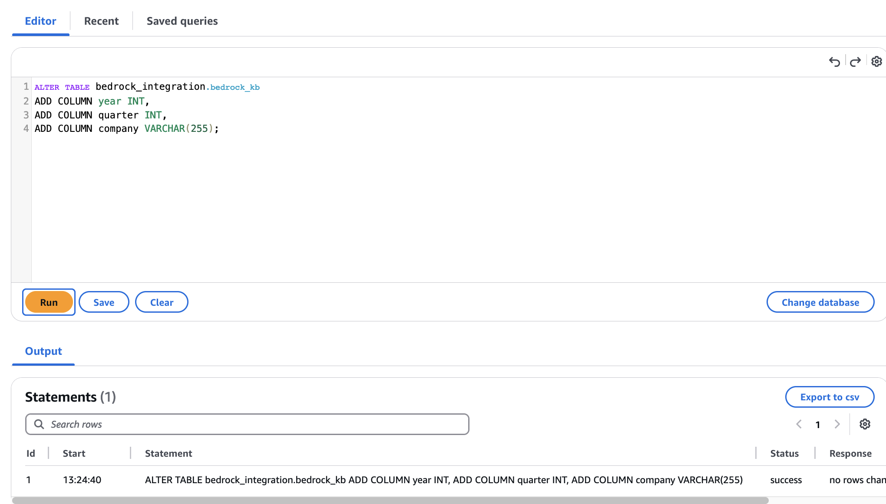

# Financial Assistant powered by Generative AI

This project contains two CDK stacks to choose:

- BackendStack
- BackendStackAurora

## Requirements

In order to deploy the stacks, you need:

- AWS CLI. Refer to [Installing the AWS CLI](https://docs.aws.amazon.com/cli/latest/userguide/cli-chap-install.html)
- AWS CDK. Refer to [Getting started with the AWS CDK](https://docs.aws.amazon.com/cdk/v2/guide/getting_started.html)
- AWS Credentials configured in your environment. Refer to
  [Configuration and credential file settings](https://docs.aws.amazon.com/cli/latest/userguide/cli-configure-files.html)
- Amazon Bedrock configured in your account.
- Node >= 18
- Docker >= 25

## Synthesize stacks

From the root folder:

```shell
$ npm install
```

Run the following command to synthesize the CloudFormation templates:

```shell
$ cdk synth
```

If this is the first time you're deploying a CDK application into your account, run the command below:

```shell
$ cdk bootstrap
```

## Backend

After synthesizing, you can choose the stack that suits well for your workload (Aurora Postgres with PGvector extension or OpenSearch).
To choose which option is the best for you, you can consider the first attention points:

* OpenSearch currently supports HYBRID search (Hybrid search takes advantage of the strengths of multiple search algorithms, integrating their unique capabilities to enhance the relevance of returned search results) and has a faster setup time (5 min) when compared to Aurora (15min).
* Aurora Postgres has low costs in general when compared to OpenSearch, which can be great to experiment for the first time.

Also, we strongly to read this [blogpost](https://aws.amazon.com/blogs/database/key-considerations-when-choosing-a-database-for-your-generative-ai-applications/) to understand key considerations when choosing a database for your generative AI applications.

Once you choose your VectorDB to experiment, you can select the deployment type between them here:

> [!WARNING] 
> Deploy just one stack that you choose according to the factors recommended above, deploying both can generate unwanted costs for your account.

<details >
<summary> <h3>Stack with OpenSearch </h3></summary>
<br>
After synthesizing, you can deploy the backend stack by running:

```shell
$ cdk deploy BackendStack --require-approval=never --outputs-file outputs.json
```

Once the deployment is concluded, CDK will return a few output variables:

- `RestApiEndpoint`: The Lambda URL that calls the RAG chatbot
- `LambdaFunctionArn`: The ARN of the Lambda function that calls the RAG chatbot
- `UserPoolIdOutput`: The UserPool ID needed for logging into the front-end application
- `UserPoolClientIdOutput`: The UserPool Client ID needed for logging into the front-end application
- `IdentityPoolIdOutput`: The Identity Pool ID needed for logging into the front-end application
- `KnowledgeBaseId`: The Id of the KnowledgeBase created.

After the deploy, you are on track with OpenSearch VectorDB configuration and can go on Document Ingestion part.
</details>

<details >
<summary> <h3> Stack with Aurora Postgres </h3></summary>
<br>

After synthesizing, you can deploy the backend stack of Aurora by running:

$ cdk deploy BackendStackAurora --require-approval=never --outputs-file outputs.json

Once the deployment is concluded, CDK will return a few output variables:

- `RestApiEndpoint`: The Lambda URL that calls the RAG chatbot
- `LambdaFunctionArn`: The ARN of the Lambda function that calls the RAG chatbot
- `UserPoolIdOutput`: The UserPool ID needed for logging into the front-end application
- `UserPoolClientIdOutput`: The UserPool Client ID needed for logging into the front-end application
- `IdentityPoolIdOutput`: The Identity Pool ID needed for logging into the front-end application
- `KnowledgeBaseId`: The Id of the KnowledgeBase created.
- `AuroraSecretsARN`:The ARN of the secrets to connect in the Aurora Database.

First, locate the ARN of the Aurora secrets, through the AWS CLI (remember to set the AWS_DEFAULT_REGION and enviroment variable):

```shell
$ aws cloudformation describe-stacks --stack-name BackendStackAurora --query "Stacks[0].Outputs[?contains(OutputKey, 'AuroraSecretsARN')].OutputValue"

[
    "OutputValue": "arn:<your_secret>"
]
```

With this value copied, go to the Amazon RDS console, then go to [Query Editor](https://us-east-1.console.aws.amazon.com/rds/home?region=us-east-1#query-editor).

Over there, select the Aurora Serverless Databse that we created via the Backend stack, in *Database username* select **Connect with a Secrets Manager ARN** , in *Secrets manager ARN* paste the ARN that you copied in the previous step. Finally, on the *name of the database* field, fill with **bedrock_vector_db**, as illustrated in the picture below:


Once you have access to Query Editor, run the following code to ensure you have the proper access to Aurora Cluster:

```sql
SELECT column_name
FROM information_schema.columns
WHERE table_schema = 'bedrock_integration'
  AND table_name = 'bedrock_kb';
```


If you receive the 4 columns illustrated in the figure above you are on track with the creation. 

Now, we have to create the columns for our metadata fields. As you can see in the step of **Ingesting documents in the Bedrock KnowledgeBase**, you may want to create or define your own metadata fields to increase your accuracy in search retrieval. Based on it, run on query editor your query with the fields you may want to create and it's respective types. 

**REMEMBER**: The same metadata columns you create here you will need to reference afterwards on the **ingestion** part. If not, it will result in errors during ingestion.

The query could be something like this (remember to change according your data):
```sql
ALTER TABLE bedrock_integration.bedrock_kb
ADD COLUMN year INT,
ADD COLUMN quarter INT,
ADD COLUMN company VARCHAR(255);
```


Once you have the field **Status** as **sucess**, you are on track with Aurora Postgres VectorDB configuration and can go on Document Ingestion part.
</details>

### Ingesting documents in the Bedrock KnowledgeBase

After deploying the Backend stack you must ingest the documents and metadata in the KnowledgeBase created. 


> [!IMPORTANT] 
> If you want to keep the original scenario of this repository, go to the follwing links and download all reports from 2023'Q2 until 2024'Q2:
>
> [Itaú Results Center](https://www.itau.com.br/relacoes-com-investidores/resultados-e-relatorios/central-de-resultados/)
>
> [XP Inc Results Center](https://investors.xpinc.com/informacoes-financeiras/resultados-trimestrais/)
>
> [Inter Bank Resuls Center](https://investors.inter.co/informacoes-aos-investidores/central-de-resultados-inter-co/)
>
>Then organize all files following the convention specified on [data folder](../data/), where for each file, create something like:
>
> `<filename>`.pdf
>
> `<filename>`.pdf.metadata.json
>
>Where metadata.json must have keys related to `company`, `year` and `quarter`.

**If you want to customize according your own data, you can following the guide below:**

> [!NOTE] 
> Put all the data you want to ingest inside [data folder](../data/), following the convention for each file:
>
> `<filename>`.pdf
>
> `<filename>`.pdf.metadata.json
>
>Where metadata.json files must have keys related to fields you want to categorize such as `department`, `year` or something else.
>
>After selecting your data, you can customize the prompts of the application to fit your data inside [prompts.js](lib/lambda/prompts.js), where you can adapt `SelfQueryTemplate` to teach the LLM on how to interact with your data and how to generate dynamically the desired filters to search information and `chatTemplate` to giving general guidelines to the LLM on to interact with your users.

**Once you have all your files inside [data folder](../data/),then go to the [root folder](../) of this repository and run:**

Linux or Mac:

```python
$ python3 ingest_files.py
```

Windows:

```python
$ python ingest_files.py
```

### Add users to Cognito User Pool

First, locate the Cognito User Pool ID, through the AWS CLI:

```shell
$ aws cloudformation describe-stacks --stack-name BackendStack --query "Stacks[0].Outputs[?contains(OutputKey, 'UserPoolId')].OutputValue"

[
    "OutputValue": "<region>_a1aaaA1Aa"
]
```

You can then go the Amazon Cognito page at the AWS Console, search for the User Pool and add users

### Enable access to Bedrock models

Models are not enabled by default on Amazon Bedrock, so if this is the first time you are going to use Amazon Bedrock, 
it is recommended to first check if the access is already enabled.

Go to the AWS Console, then go to Amazon Bedrock

Click Model access at the left side


Click the **Enable specific models** button and enable the checkbox for Anthropic Claude models

Click **Next** and **Submit** buttons

## Frontend
This is the front-end demo application. With this, you'll be able to interact with a chatbot with your data.


### Technologies

- React + Typescript (through Vite)
- Amplify UI (authentication flow)
- TailwindCSS (styling)
- shadcn/ui (custom components)

### Prerequisites

- Node/npm
- The deployed back-end.
- At least one user added on the appropriate Amazon Cognito User Pool (required for authenticated API calls).

### Setup and run

1. After successfully deploying your back-end stack, you can easily find the information required for the next step by inspecting Amazon CloudFormation console.

2. Create a `.env` file by duplicating the included `example.env` and replace the property values with the values retrieved from the Stack outputs.

  ```properties
  VITE_REGION_NAME="<REGION_NAME>"
  VITE_COGNITO_USER_POOL_ID="<COGNITO_USER_POOL_ID>"
  VITE_COGNITO_USER_POOL_CLIENT_ID="<COGNITO_USER_POOL_CLIENT_ID>"
  VITE_COGNITO_IDENTITY_POOL_ID="<COGNITO_IDENTITY_POOL_ID>"
  VITE_API_FUNCTION_ARN="<API_FUNCTION_ARN>"
  VITE_APP_NAME="Financial Assistant"
  VITE_LOCAL_MOCK="FALSE"
  ```

3. Go to **src/webapp**, install dependencies:

   ```shell
   $ npm ci
   ```

4. Start web application

   ```shell
   $ npm run dev
   ```

A url like `http://localhost:5173/` will be displayed, so you can open the web application from your browser 
If you wish to run the front-end application locally, you can use these values to create a `.env` like the following:

## How to customize the chatbot to your use case  

This solution was designed to support analysis of data of different types and of different languages via a chabot.

The customization of this code basically comprises three major configuration artifacts:

- Add your own data and metadata on **data** folder, related to the scope which you want the chatbot answer about
- On  **src/lib/backend-stack.ts** changes the lines 86 to 92 with your own definitions, such as output language, model to be used and general parameters
- Customize the prompt on **src/lib/lambda/prompts.js** to adhere appropriately to the expected context for the scope of your application.

## Warning about hosting
It is definitely recommended to perform a thorough security testing, including pen-tests, before hosting this Front-end application publicly. The work is provided “AS IS” without warranties or conditions of any kind, either express or implied, including warranties or conditions of merchantability.
